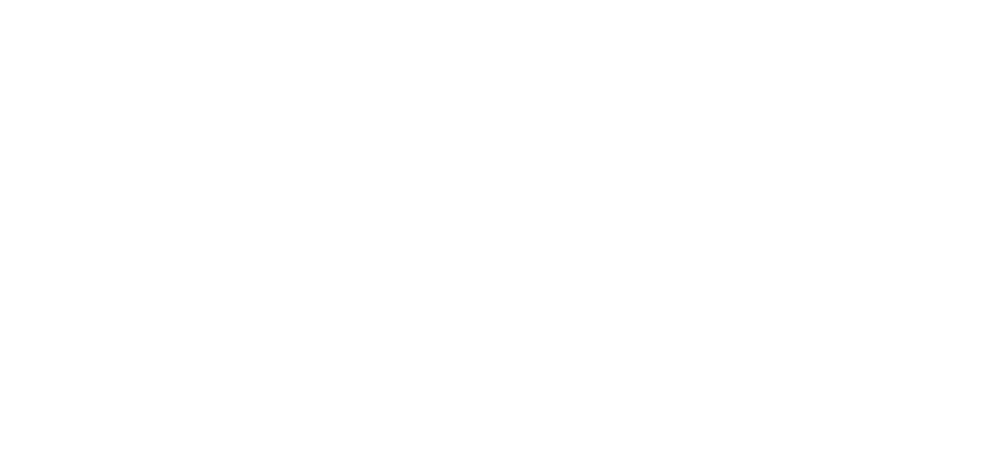

# Pistoia-Alliance-PGO

## Pistoia Alliance Pharma General Ontology (PGO)

License: [CC BY 4.0](https://creativecommons.org/licenses/by/4.0/). Please see Terms of Use for details.

<!-- TOC start  -->

   * [Objective](#objective)
   * [Rationale](#rationale)
- [Project webpage](#project-webpage)
- [Project Outputs Phase 1](#project-outputs-phase-1)
   * [List of core concepts](#list-of-core-concepts)
   * [High level use case report](#high-level-use-case-report-project-webpage-see-deliverables-and-resources)
   * [Process](#process)
   * [Summaries of alignments meetings](#summaries-of-alignments-meetings)
   * [Files](#)
- [Project Roadmap](#project-roadmap)
- [Project sponsors ](#project-sponsors)
- [List of experts](#list-of-experts)
- [References:](#references)

<!-- TOC end -->

### Objective
The first objective of PGO is to define a set of agreed-upon core entities, the PGO "core concepts",  and recommendations for associating controlled terminologies to service data exchange of Research & Development (R&D) information among Pharmaceutical Industry stakeholders.

### Rationale

Information exchange within and across organizations in the pharmaceutical industry is hampered by insufficient or ambiguous asset descriptions.
These descriptions should ideally allow for validation, facilitation of discovery and promotion of interoperability. 
All of these have the potential to deliver significant gains for data exploitation and value delivery in the drug development pipeline, ultimately bringing better treatments to patients.

*The remit of PGO, rather than mandate the use of a resource over another, is to enable clarity when declaring which controlled terminologies are used and why*.

True to the FAIR principles of data management [1] and their use in the Pharmaceutical Industry [2], the PGO aims to
*reuse* existing semantic resources (ontologies and controlled terminologies) as well as open source community software, rather than creating new ones.

The initial goal of PGO is to provide enough coverage to represent essential entities, most frequently used or referred to when exchanging data.
The project team initial focus is on the research and early development (R&ED) phase. 

**The key objectives are therefore**:
- [x] Unambiguously identifying essential entities
- [x] Specifying, when applicable, value-sets for key attributes by relying on community-agreed controlled terminologies
- [x] Creating machine actionable documentation

On the issue of defining value-sets, PGO's intent is to provide clear mechanisms to enable unambiguous declaration of the resources used as well as capture the criteria used to select semantic artifacts. We will do so by following community best practices. 

## Project webpage
Additional documents from the project are accessible via the [Pharma General Ontology project webpage](https://www.pistoiaalliance.org/project/pharma-general-ontology/). A log in to access documents reserved to Pistoia Alliance member companies is required.

## Project Outputs Phase 1

### [List of core concepts](./2025_PGO_V1.0_core_concepts.md)

### [High level use case report](https://www.pistoiaalliance.org/resource-library/pharma-general-ontology-use-cases/)

### [Process](https://github.com/Pistoia-Alliance-Inc/Pistoia-Alliance-PGO/wiki/2024%E2%80%90PGO-process)

### [Summaries of alignments meetings](https://github.com/Pistoia-Alliance-Inc/Pistoia-Alliance-PGO/wiki/2024_PGO_V1.0-_summary_meetings)

### Files
  - [PGO_V1.0 list CSV](https://github.com/Pistoia-Alliance-Inc/Pistoia-Alliance-PGO/blob/development/PGO_V1.0_core_concepts_2026-03-20.csv)
  - [PGO_V1.0 list Excel](https://github.com/Pistoia-Alliance-Inc/Pistoia-Alliance-PGO/blob/development/PGO_V1.0_core_concepts_2026-03-20.xlsx)

### Technology
The project is currently using the [LinkML](https://linkml.io) language for representing and documenting each of the types [3].

## Project Roadmap
- 2023: initial scoping and identification of core concepts from the FAIR implementation project

*Phase 1*
- 2024: process flow, expert identification, core concept candidate definitions
- 2024: high level use case identificaiton and definition [4]
- 2025: experts consultation and alignment, formalization of core concepts R&ED
- 2025: implementation and testing using LinkML
- 2025: first release of the recommended core-concepts

*Phase 2*
- 2025 application and "field testing"
- 2025 complement core-concept vocabulary
- 2026 updated version of core-concept vocabulary
- 2026 Machine-readable version of PGO-terminology

## Project sponsors 
Phase 1
- Astrazeneca
- Chiesi Group
- Glaxo Smith Kline PLC
- Merck KgaA
- Novo Nordisk
- Pfizer
- Hoffman la Roche AG

## [List of PGO experts consulted](./list-of-experts.md)

## References:
1. [https://www.nature.com/articles/sdata201618](https://www.nature.com/articles/sdata201618)
2. [https://pubmed.ncbi.nlm.nih.gov/35066138/](https://pubmed.ncbi.nlm.nih.gov/35066138/)
3. [https://pubmed.ncbi.nlm.nih.gov/36125173/](https://pubmed.ncbi.nlm.nih.gov/36125173/)
4. [PGO deliverable D2.2-Use cases](https://www.pistoiaalliance.org/resource-library/pharma-general-ontology-use-cases/)

